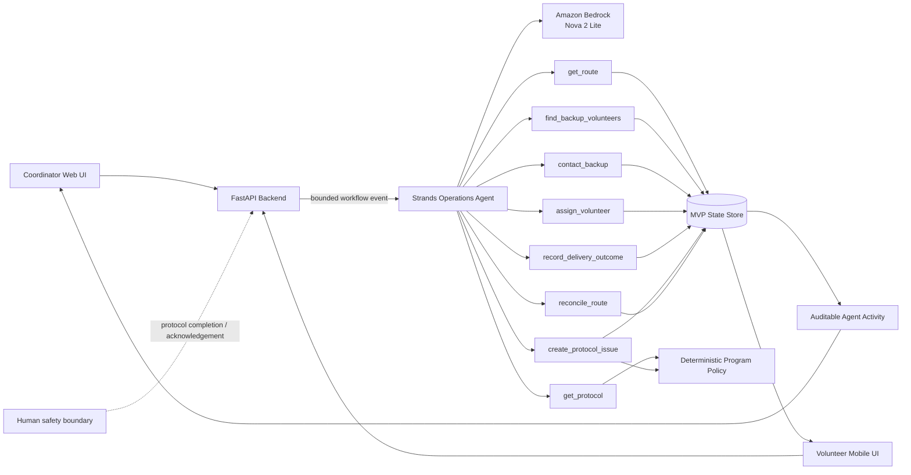

# Porchlight Architecture

Porchlight deliberately separates **agent reasoning** from **policy enforcement**. Strands chooses and sequences operational tools; tools validate eligibility, acceptance, human protocol completion, and route-close conditions.

## Safety boundary

- Strands may decide **which permitted logistics tool to use next**.
- `assign_volunteer` refuses assignment unless an eligible volunteer was contacted and accepted.
- `create_protocol_issue` refuses escalation unless the volunteer explicitly confirmed the configured protocol was completed.
- Severity, escalation target, and no-answer language come from deterministic program policy, not the model.
- `reconcile_route` refuses clean closure while outcomes or required acknowledgements are unresolved.
- No medical diagnosis or welfare inference is delegated to the model.

## Hackathon data

All recipient, volunteer, address, and route data in the demo is synthetic. Backup communications are simulated so judges can replay the workflow consistently; the orchestration and tool selection are performed by Strands in live mode.
